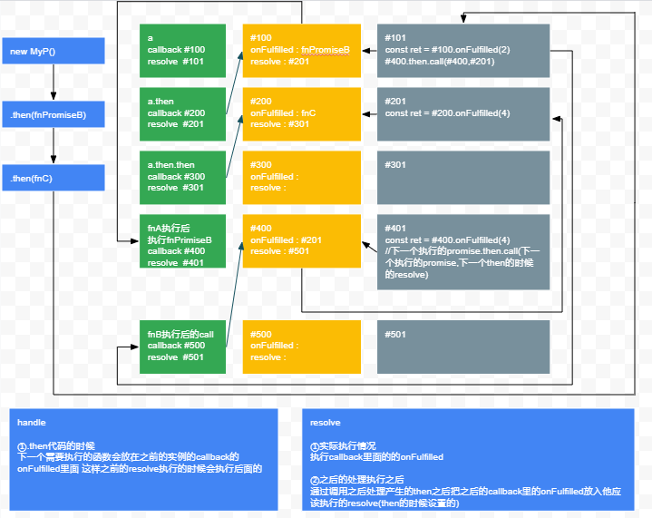

# Promise
尝试手写promise
## 进度
1. then => done
2. resolve => done
3. reject
4. catch
5. finally
6. all
7. race
8. allSettled
9. any
## 思路

## 测试代码
```js
const p = new MyP((resolve) => {
  const input = 2;
  console.log(`start input = ${input}`);
  setTimeout(resolve, 500, input);
});

function multiply(input) {
  return new MyP(function (resolve) {
    console.log("calculating " + input + " x " + input + "...");
    setTimeout(resolve, 500, input * input);
  });
}

function add(input) {
  return new MyP(function (resolve) {
    console.log("calculating " + input + " + " + input + "...");
    setTimeout(resolve, 500, input + input);
  });
}
p.then(multiply)
  .then(add)
  .then((result) => {
    console.log("Got value: " + result);
  });
```
## 实现代码
[MyPromise](./Promise.js)
※代码有很多没用的id追踪用,完成后删除预定
